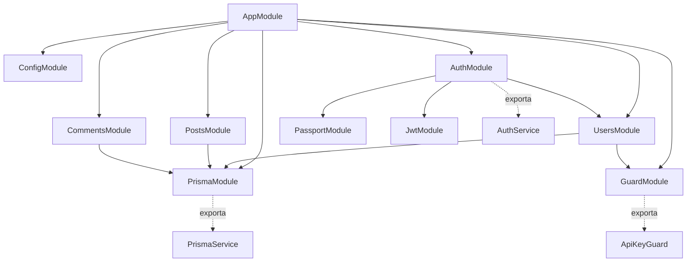
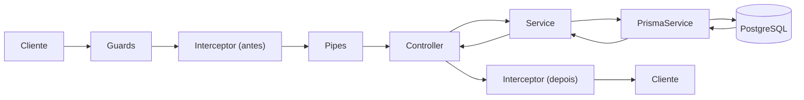
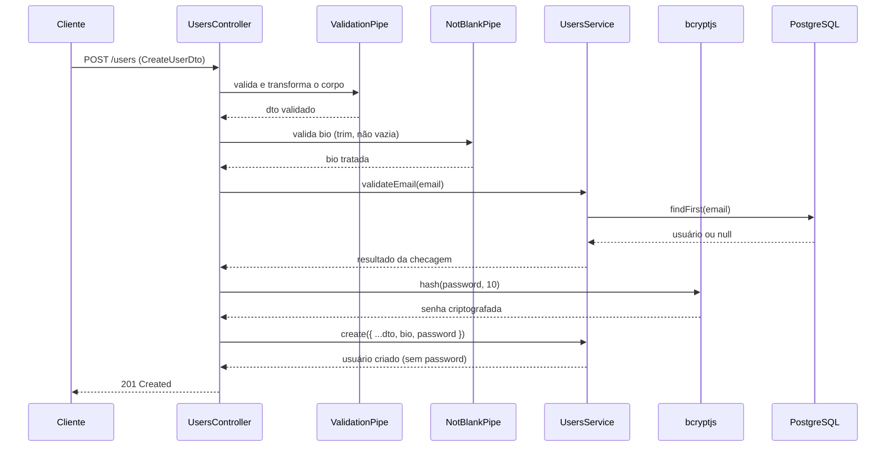
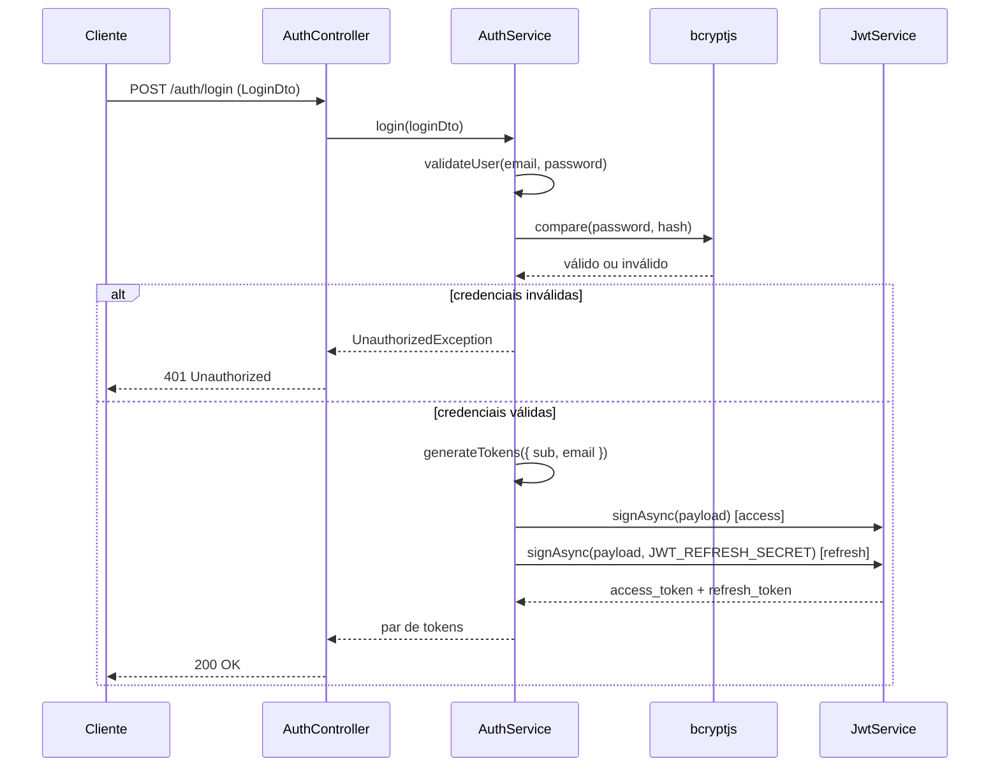
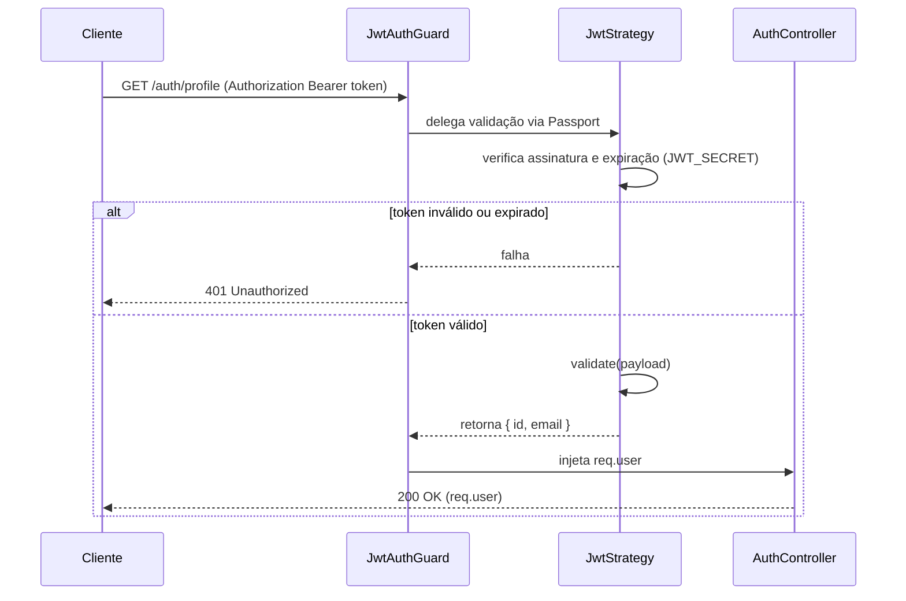
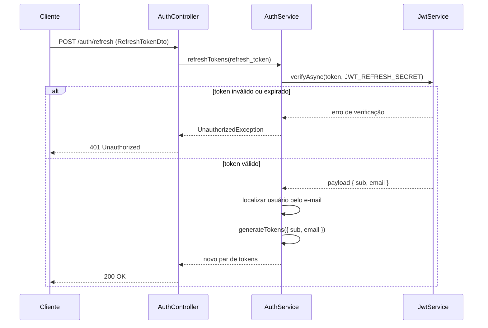
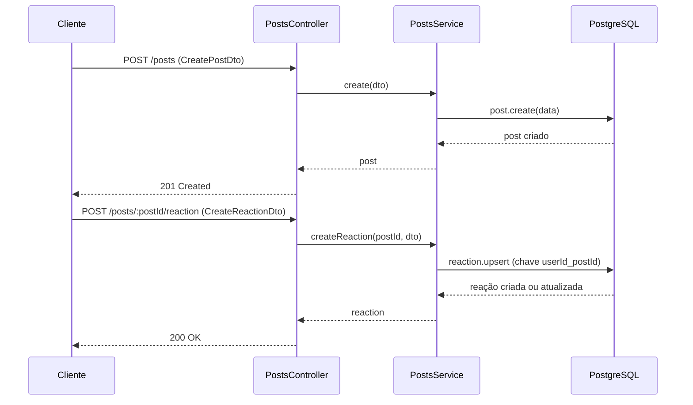
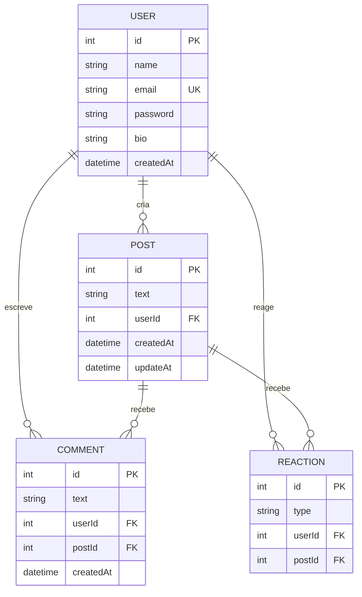
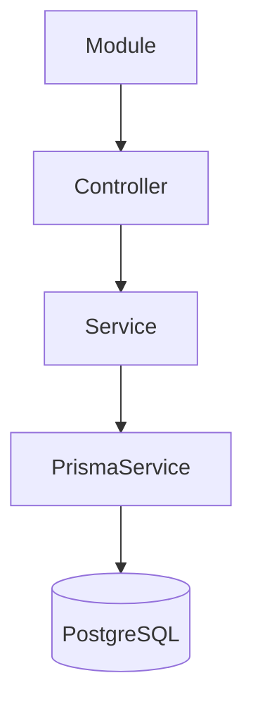

# Relatório Técnico — DevConnect API

> Documento de referência para geração de diagramas (app.diagrams.net) e para apresentação ao professor. Descreve o design pretendido do projeto, em ordem cronológica de execução: do bootstrap da aplicação até o ciclo completo de uma requisição. Todos os blocos `mermaid` abaixo são válidos e podem ser colados diretamente em um gerador de diagramas ou renderizados em qualquer visualizador Markdown/Mermaid.

## Sumário

1. [Visão geral](#1-visão-geral)
2. [Arquitetura em camadas do NestJS](#2-arquitetura-em-camadas-do-nestjs-e-por-quê)
3. [Bootstrap — `src/main.ts`](#3-bootstrap--srcmaints)
4. [Módulo raiz — `src/app.module.ts`](#4-módulo-raiz--srcappmodulets)
5. [Camada de dados — Prisma](#5-camada-de-dados--prisma)
6. [Validação de entrada — DTOs + ValidationPipe](#6-validação-de-entrada--dtos--validationpipe)
7. [Pipes customizados](#7-pipes-customizados--srccommonpipes)
8. [Interceptor — logging](#8-interceptor--srccommoninterceptoreslogginginterceptorts)
9. [Guards — controle de acesso](#9-guards--controle-de-acesso)
10. [Autenticação — `src/auth/`](#10-autenticação--srcauth-o-núcleo-do-relatório)
11. [Recursos de domínio — Posts, Comments, Reactions](#11-recursos-de-domínio--posts-comments-reactions)
12. [Ciclo de vida de uma requisição no NestJS](#12-ciclo-de-vida-de-uma-requisição-no-nestjs-ordem-canônica)
13. [Especificação para o diagrama de componentes](#13-especificação-para-o-diagrama-de-componentes-drawio)
14. [Diagramas](#14-diagramas-mermaid-prontos)
15. [Apêndice: tabela de rotas](#15-apêndice-tabela-de-rotas)

---

## 1. Visão geral

O **DevConnect** é uma API REST de rede social simples: usuários se cadastram, publicam posts (textos curtos), comentam nos posts uns dos outros e reagem a eles com `LIKE` ou `DISLIKE`. O projeto foi construído em NestJS como exercício de arquitetura backend — o objetivo não é só "funcionar", mas demonstrar separação de responsabilidades, validação de entrada, autenticação com tokens e persistência relacional.

### Stack e o porquê de cada peça

| Peça | Papel no projeto | Por que essa escolha |
|---|---|---|
| **NestJS 11** | Framework HTTP/estrutural | Impõe uma arquitetura em camadas (Módulo → Controller → Service) por convenção, com Injeção de Dependência nativa — evita que o projeto vire um conjunto de rotas soltas. |
| **TypeScript** | Linguagem | Tipagem estática detecta erros de contrato (formato de dados) em tempo de compilação, antes de chegar em produção. |
| **Prisma 7 + PostgreSQL** (`@prisma/adapter-pg`) | ORM e banco relacional | O domínio (usuários, posts, comentários, reações) é naturalmente relacional — com chaves estrangeiras e restrições de unicidade. Prisma gera um client tipado a partir do `schema.prisma`, então o código TypeScript nunca perde sincronia com a estrutura real do banco. |
| **`@nestjs/jwt` + `passport-jwt`** | Autenticação por token | Permite autenticação **stateless**: o servidor não guarda sessão em memória, só confere a assinatura do token a cada requisição — essencial para uma API que pode escalar horizontalmente. |
| **`bcryptjs`** | Hash de senha | Senha nunca é armazenada nem comparada em texto puro — só o hash (função de mão única) é persistido. |
| **`class-validator` / `class-transformer`** | Validação declarativa de DTOs | Permite descrever as regras de cada campo (`@IsEmail`, `@MinLength`, etc.) diretamente na classe do DTO, e o Nest aplica essas regras automaticamente via `ValidationPipe`, sem checagem manual em cada controller. |
| **`@nestjs/config`** | Variáveis de ambiente tipadas | Centraliza o acesso a segredos (`JWT_SECRET`, `DATABASE_URL`, etc.) através de um único serviço injetável, em vez de ler `process.env` espalhado pelo código. |

### Referências de arquivos

- Código-fonte: `devconnect/src/`
- Schema do banco: `devconnect/prisma/schema.prisma`
- Dependências e scripts: `devconnect/package.json`

---

## 2. Arquitetura em camadas do NestJS (e por quê)

O DevConnect segue o fluxo padrão do NestJS em toda funcionalidade:

```
Module → Controller → Service → PrismaService → PostgreSQL
```

**Papel de cada camada:**

- **Module**: agrupa tudo que pertence a um mesmo domínio (ex: tudo sobre `posts` vive dentro de `PostsModule`) e declara explicitamente o que importa, o que fornece (`providers`) e o que expõe pra fora (`exports`).
- **Controller**: a única camada que conhece HTTP — recebe a requisição, delega pro Service, devolve a resposta. Não deveria conter regra de negócio.
- **Service**: onde a regra de negócio de fato acontece — validações específicas do domínio, orquestração de chamadas ao banco, decisões (ex: "esse post existe? se não, lança 404").
- **PrismaService**: a única camada que sabe conversar com o banco. Encapsula o `PrismaClient` e é injetada em qualquer Service que precise persistir dados.
- **PostgreSQL**: onde os dados realmente residem, de forma durável.

**Por que separar dessa forma:**

1. **Responsabilidade única** — cada camada tem um motivo só pra mudar. Se a regra de negócio de "post" muda, só `PostsService` muda; se a rota muda, só `PostsController` muda.
2. **Testabilidade** — um Service pode ser testado isoladamente, injetando um `PrismaService` falso (mock), sem precisar subir um servidor HTTP nem um banco real.
3. **Reuso** — o mesmo Service pode ser chamado por mais de um Controller (ou por um Guard, um Job agendado, etc.) sem duplicar lógica.

### Como a Injeção de Dependência conecta tudo

Nenhuma classe do projeto instancia suas próprias dependências com `new`. Em vez disso, cada classe declara no `constructor` o que precisa (ex: `constructor(private readonly usersService: UsersService)`), e o Nest resolve essa dependência automaticamente em tempo de execução, consultando o grafo de `providers`/`imports`/`exports` declarado em cada `@Module`. Isso é o que permite, por exemplo, que `PrismaModule` forneça uma única instância de `PrismaService` (com uma única conexão ao banco) compartilhada por `UsersModule`, `PostsModule` e `CommentsModule` ao mesmo tempo.

---

## 3. Bootstrap — `src/main.ts`

Ordem exata de inicialização da aplicação:

1. **`NestFactory.create(AppModule)`** — monta o grafo completo de módulos, resolvendo todas as dependências declaradas (`imports`, `providers`, `exports`) antes de aceitar qualquer requisição.
2. **`app.useGlobalInterceptors(new LoggingInterceptor())`** — registra o interceptor de log para **toda** rota da aplicação, sem precisar decorar cada controller individualmente.
3. **`app.useGlobalPipes(new ValidationPipe({ whitelist: true, transform: true }))`** — registra a validação global de DTOs:
   - `whitelist: true` — remove automaticamente qualquer campo enviado no corpo da requisição que não esteja declarado no DTO correspondente. Isso impede que um cliente injete campos extras (ex: um `role: 'admin'` escondido no body de um cadastro).
   - `transform: true` — converte o JSON bruto recebido numa instância real da classe do DTO, respeitando os tipos declarados (ex: uma string `"42"` na URL vira `number` quando o parâmetro é tipado como tal).
4. **`app.listen(process.env.PORT ?? 3000)`** — sobe o servidor HTTP na porta configurada, com `3000` como padrão caso `PORT` não esteja definida.

**Por que essa ordem importa:** interceptors e pipes globais precisam estar registrados **antes** de `listen()` — eles fazem parte do pipeline que toda requisição atravessa, então precisam existir antes que qualquer requisição possa chegar.

---

## 4. Módulo raiz — `src/app.module.ts`

```ts
@Module({
  imports: [
    ConfigModule.forRoot({ isGlobal: true }),
    AuthModule,
    UsersModule,
    PrismaModule,
    PostsModule,
    CommentsModule,
    GuardModule,
  ],
  controllers: [AppController],
  providers: [AppService],
})
export class AppModule {}
```

- **`ConfigModule.forRoot({ isGlobal: true })`**: carrega as variáveis de ambiente (do `.env`) uma única vez e as disponibiliza para **qualquer** módulo da aplicação via `ConfigService`, sem precisar reimportar `ConfigModule` em cada módulo filho. É por isso que `AuthModule`, `PrismaService` e outros conseguem injetar `ConfigService` diretamente.
- **`AuthModule`**: concentra login, emissão/renovação de tokens e a estratégia JWT.
- **`UsersModule`**: cadastro, consulta e gestão de usuários.
- **`PrismaModule`**: fornece o `PrismaService` (conexão com o banco) para os módulos que persistem dados.
- **`PostsModule`** e **`CommentsModule`**: os dois recursos de domínio que dependem diretamente do banco via Prisma.
- **`GuardModule`**: fornece o `ApiKeyGuard`, reutilizável por qualquer controller que precise dessa camada extra de proteção.

---

## 5. Camada de dados — Prisma

### `src/prisma/prisma.service.ts`

```ts
@Injectable()
export class PrismaService extends PrismaClient {
  constructor() {
    const adapter = new PrismaPg({ connectionString: process.env.DATABASE_URL });
    super({ adapter });
  }
}
```

- **O que faz**: estende `PrismaClient` (a classe gerada pelo Prisma a partir do `schema.prisma`) e a conecta ao PostgreSQL através do `PrismaPg` adapter, usando a string de conexão `DATABASE_URL`.
- **Por que um service injetável**: transformar o client em um `@Injectable()` do Nest permite que ele participe do ciclo de vida da aplicação (uma única instância, uma única conexão, reaproveitada por todos os Services que a injetam) em vez de cada Service abrir sua própria conexão com o banco.

### `src/prisma/prisma.module.ts`

Declara `PrismaService` em `providers` **e** em `exports` — sem o `exports`, nenhum outro módulo conseguiria importar `PrismaModule` e usar o service de dentro dele.

### `prisma/schema.prisma` — modelos

- **`User`**: `id`, `name`, `email` (único), `password` (hash), `bio` (opcional), `createdAt`, e as relações reversas `posts`, `comments`, `reactions`.
- **`Post`**: `id`, `text`, `userId` (chave estrangeira para `User`), `comments`, `reactions`, `createdAt`, `updateAt`.
- **`Comment`**: `id`, `text`, `userId` e `postId` (chaves estrangeiras), `CreatedAt`. `onDelete: Cascade` na relação com `Post` — se um post é apagado, seus comentários são apagados junto, evitando comentários órfãos.
- **`Reaction`**: `id`, `type` (enum `ReactionType`), `userId` e `postId`. `@@unique([userId, postId])` garante, no nível do banco, que **um mesmo usuário só pode ter uma reação ativa por post** — a segunda tentativa de reagir não cria uma nova linha, apenas atualiza a existente (ver seção 11, `upsert`). Também usa `onDelete: Cascade` com `Post`.
- **`enum ReactionType`**: `LIKE` | `DISLIKE`.

### `prisma/migrations/`

- **`20260825144519_init`**: migration inicial — cria as quatro tabelas (`User`, `Post`, `Comment`, `Reaction`), o enum `ReactionType`, os índices únicos (`User.email`, `Reaction.userId_postId`) e todas as chaves estrangeiras.
- **`20260825145744_bio`**: migration incremental — adiciona a coluna opcional `bio` à tabela `User`.

**Por que migrations**: cada migration é um passo versionado e reproduzível da evolução do schema. Em vez de alterar o banco manualmente, cada mudança de modelo vira um arquivo `.sql` rastreado no controle de versão, aplicável em qualquer ambiente (dev, teste, produção) na mesma ordem.

### Diagrama ER

Ver [seção 14.h](#h-er-do-banco).

---

## 6. Validação de entrada — DTOs + ValidationPipe

**O padrão usado em todo o projeto**: cada rota que recebe corpo (`@Body()`) declara um **DTO** (Data Transfer Object) — uma classe decorada com `class-validator` que descreve exatamente o formato esperado. O `ValidationPipe` global (seção 3) intercepta a requisição **antes** dela chegar no método do controller, valida o corpo contra os decorators do DTO e só deixa passar se tudo estiver correto — senão, responde automaticamente com `400 Bad Request` e a mensagem de erro de cada campo.

### DTOs e seus decorators

| DTO | Campos e regras |
|---|---|
| `create-user.dto.ts` | `name` (`@IsString`, `@IsNotEmpty`), `email` (`@IsEmail`), `password` (`@IsString`, `@MinLength(6)`), `bio` (`@IsOptional`, `@IsString`, `@IsNotEmpty`) |
| `replace-user.dto.ts` | `name` (`@IsString`, `@IsNotEmpty`), `email` (`@IsEmail`), `bio` (`@IsOptional`, `@IsString`, `@IsNotEmpty`) — usado no `PUT` (substituição completa) |
| `update-user.dto.ts` | `extends PartialType(CreateUserDto)` — usado no `PATCH` |
| `login.dto.ts` | `email` (`@IsString`, `@IsNotEmpty`, `@IsEmail`), `password` (`@IsString`, `@IsNotEmpty`) |
| `refresh-token.dto.ts` | `refresh_token` (`@IsString`, `@IsNotEmpty`) |
| `create-post.dto.ts` | `text` (`@IsString`, `@IsNotEmpty`), `userId` (`@IsInt`) |
| `create-reaction.dto.ts` | `userId` (`@IsInt`, `@IsNotEmpty`), `type` (`@IsEnum(ReactionType)`) — só aceita `LIKE` ou `DISLIKE` |
| `create-comment.dto.ts` | `userId` (`@IsInt`, `@IsNotEmpty`), `text` (`@IsString`, `@IsNotEmpty`) |

### `PartialType` nos DTOs de atualização

`update-user.dto.ts`, `update-post.dto.ts` e `update-comment.dto.ts` seguem o mesmo padrão: `extends PartialType(CreateXDto)`. Isso reaproveita todas as regras de validação do DTO de criação, mas torna **todos os campos opcionais** — correto para um `PATCH`, onde o cliente só precisa enviar os campos que quer alterar, sem repetir os obrigatórios.

### Pipes de parâmetro

Além dos DTOs (que validam o `Body`), rotas com identificador na URL usam **`ParseIntPipe`** — uma pipe pronta do próprio Nest que converte o parâmetro de rota (sempre uma `string`, por vir da URL) em `number`, e já responde `400 Bad Request` automaticamente se o valor não for um número válido. Exemplo: `@Param('id', ParseIntPipe) id: number`.

---

## 7. Pipes customizados — `src/common/pipes/`

Nem toda regra de validação existe pronta em `class-validator`. Quando a regra é específica do projeto, ela vira uma **Pipe customizada**, aplicada diretamente no parâmetro que precisa dela.

### `NotBlankPipe`

```ts
@Injectable()
export class NotBlankPipe implements PipeTransform {
  transform(value: any, metadata: ArgumentMetadata) {
    if (value === undefined || value === null) return value;
    const trimmed = String(value).trim();
    if (trimmed.length === 0) {
      throw new BadRequestException(`${metadata.data} não pode ser um texto em branco`);
    }
    return trimmed;
  }
}
```

- **O que faz**: rejeita uma string que, depois de removidos os espaços das pontas (`trim`), fica vazia — ou seja, um campo preenchido só com espaços em branco não é tratado como preenchido.
- **Onde é usada e por quê**: aplicada diretamente no campo `bio` (`UsersController`) e no campo `text` (`PostsController`, `CommentsController`) via `@Body('bio', NotBlankPipe)` / `@Body('text', NotBlankPipe)` — uma forma de extrair **um campo específico** do corpo e aplicar uma regra pontual nele, complementando (não substituindo) a validação declarativa do DTO inteiro.

### `NameValidationPipe`

```ts
@Injectable()
export class NameValidationPipe implements PipeTransform {
  transform(value: any, metadata: ArgumentMetadata) {
    if (/\d/.test(value)) {
      throw new BadRequestException(`${metadata.data} não pode conter números`);
    }
    return value;
  }
}
```

- **O que faz**: rejeita o valor se ele contiver qualquer dígito.
- **Onde é usada e por quê**: aplicada no parâmetro de rota da busca por nome (`GET /users/search/:name`) — uma regra de negócio específica (nome de usuário não deveria conter números) que não existe pronta em nenhuma lib de validação.

---

## 8. Interceptor — `src/common/interceptores/logging.interceptor.ts`

```ts
@Injectable()
export class LoggingInterceptor implements NestInterceptor {
  intercept(context: ExecutionContext, next: CallHandler): Observable<any> {
    const req = context.switchToHttp().getRequest();
    const start = Date.now();
    console.log(`[REQUEST] ${req.method} ${req.url}`);
    return next.handle().pipe(
      tap(() => {
        const time = Date.now() - start;
        console.log(`[RESPONSE] ${req.method} ${req.url} - ${time}ms`);
      }),
    );
  }
}
```

- **O que faz**: registra no console o método e a URL de cada requisição assim que ela chega (`[REQUEST]`), e o tempo total de processamento assim que a resposta está pronta (`[RESPONSE] ...ms`).
- **Por que um Interceptor, e não outra camada**: um Interceptor implementa `NestInterceptor` e recebe, além do `context`, um `next: CallHandler` que representa "o resto da cadeia" (o Controller e tudo que vem depois). Chamar `next.handle()` retorna um `Observable` (RxJS) — é isso que permite ao interceptor **envolver** a requisição inteira: o código antes de `next.handle()` roda na entrada, e o operador `tap()` dentro do `.pipe()` roda na saída, depois que a resposta já foi produzida, sem alterar o valor que passa por ele. Nenhuma outra camada (Guard, Pipe) consegue observar tanto o "antes" quanto o "depois" de uma mesma requisição — por isso logging e métricas de tempo são o caso de uso natural de um Interceptor.
- **Registrado globalmente** em `main.ts` (seção 3), roda em toda rota sem precisar decorar cada controller.

---

## 9. Guards — controle de acesso

### `src/guard/guard.service.ts` — `ApiKeyGuard`

```ts
@Injectable()
export class ApiKeyGuard implements CanActivate {
  canActivate(context: ExecutionContext): boolean {
    const request = context.switchToHttp().getRequest();
    const apiKey = request.headers['x-api-key'];
    if (!apiKey || apiKey !== process.env.APIKEY) {
      return false;
    }
    return true;
  }
}
```

- **O que faz**: exige que a requisição traga um header `x-api-key` idêntico ao valor guardado em `process.env.APIKEY`. Se não bater, retorna `false` e o Nest devolve `403 Forbidden` automaticamente, sem o handler do controller chegar a executar.
- **Por que existe**: é uma camada de proteção própria do projeto, independente de identidade de usuário — controla **quem tem permissão de usar a API como cliente/parceiro**, não quem está logado. É por isso que ele é declarado e exportado por um módulo próprio (`GuardModule`), reutilizável por qualquer controller que precise dele.

### `src/auth/jwt-auth.guard.ts` — `JwtAuthGuard`

```ts
@Injectable()
export class JwtAuthGuard extends AuthGuard('jwt') {}
```

- **O que faz**: em vez de implementar `canActivate` manualmente, herda de `AuthGuard('jwt')` do Passport — a string `'jwt'` identifica qual `PassportStrategy` usar (a `JwtStrategy`, seção 10.6). Toda a lógica de extrair o token do header, verificar assinatura e expiração já vem pronta da biblioteca.
- **Por que existe**: controla **identidade** — só deixa passar quem apresenta um JWT de acesso válido, emitido previamente pelo login.

### Ordem em `@UseGuards(ApiKeyGuard, JwtAuthGuard)`

Nas rotas de criação e substituição de usuário (`UsersController`), os dois Guards são aplicados juntos: primeiro confere a chave de API (é um cliente autorizado a falar com a API?), depois confere o token JWT (é um usuário autenticado?). Os Guards são avaliados na ordem declarada — se `ApiKeyGuard` já barrar, `JwtAuthGuard` nem chega a rodar.

---

## 10. Autenticação — `src/auth/` (o núcleo do relatório)

O módulo de autenticação é o coração do projeto: garante que só usuários identificados corretamente acessam recursos protegidos, sem exigir login a cada requisição.

### 10.1 `AuthModule`

```ts
@Module({
  imports: [
    UsersModule,
    PassportModule,
    JwtModule.registerAsync({
      imports: [ConfigModule],
      inject: [ConfigService],
      useFactory: (configService: ConfigService) => ({
        secret: configService.get<string>('JWT_SECRET'),
        signOptions: { expiresIn: configService.get<string>('JWT_EXPIRES_IN') || '30s' },
      }),
    }),
  ],
  controllers: [AuthController],
  providers: [AuthService, JwtStrategy],
  exports: [AuthService],
})
export class AuthModule {}
```

- **O que faz**: importa `UsersModule` (precisa consultar usuários), `PassportModule` (integração com a estratégia JWT) e configura o `JwtModule` de forma assíncrona — a chave secreta e o tempo de expiração vêm do `ConfigService`, nunca hardcoded no código.
- **Por quê `registerAsync`**: o segredo (`JWT_SECRET`) só existe depois que as variáveis de ambiente forem carregadas pelo `ConfigModule` — `registerAsync` permite injetar o `ConfigService` numa fábrica (`useFactory`) executada nesse momento, em vez de exigir o valor síncrono e imediato.
- **Expiração curta por padrão** (`'30s'` se `JWT_EXPIRES_IN` não estiver definida): útil pedagogicamente — o token de acesso expira rápido o suficiente para demonstrar o fluxo de refresh na prática, sem esperar minutos.

### 10.2 Registro de usuário

`POST /users` → `ValidationPipe` global valida `CreateUserDto` → `NotBlankPipe` valida a `bio` → o controller verifica se o e-mail já existe → `bcrypt.hash(password, 10)` → persistência via `UsersService.create`.

**Por que hash com salt**: `bcrypt.hash(senha, 10)` não apenas transforma a senha numa sequência irreversível (hash), como aplica um "sal" (salt) — um valor aleatório embutido no próprio hash, com custo computacional 10 (número de rounds). Isso garante que duas senhas iguais gerem hashes diferentes, e torna ataques de força bruta / rainbow table impraticáveis. A senha em texto puro nunca é persistida, nunca é logada, e some da memória assim que o hash é gerado.

### 10.3 Login

`POST /auth/login` → `LoginDto` → `AuthService.login(loginDto)`:

1. `validateUser(email, password)` busca o usuário pelo e-mail.
2. Compara a senha recebida com o hash salvo via `bcrypt.compare(password, user.password)` — a comparação também é feita sobre o hash, a senha em texto puro nunca é reconstruída.
3. Se válido, remove o campo `password` do objeto do usuário antes de prosseguir (nunca retorna o hash para fora do service).
4. Chama `generateTokens({ sub: user.id, email: user.email })`.

### 10.4 `generateTokens` (privado)

```ts
private async generateTokens(payload: { sub: number; email: string }) {
  const [access_token, refresh_token] = await Promise.all([
    this.jwtService.signAsync(payload),
    this.jwtService.signAsync(payload, {
      secret: this.configService.get<string>('JWT_REFRESH_SECRET'),
      expiresIn: this.configService.get<string>('JWT_REFRESH_EXPIRES_IN') || '7d',
    }),
  ]);
  return { access_token, refresh_token };
}
```

- **O que faz**: assina dois tokens em paralelo (`Promise.all`) a partir do mesmo payload — um access token (usando o segredo e a expiração padrão configurados no `JwtModule`) e um refresh token (usando um segredo e uma expiração **diferentes**, `JWT_REFRESH_SECRET` / `JWT_REFRESH_EXPIRES_IN`, com `7d` como padrão).
- **Por que dois tokens e dois segredos**: o access token tem vida curta de propósito — se vazar, o estrago é limitado, porque expira rápido. O refresh token tem vida longa e serve só para obter um novo access token sem pedir login novamente. Usar **segredos diferentes** para cada um garante que comprometer um não permite forjar o outro — são duas superfícies de ataque independentes.

### 10.5 Refresh

`POST /auth/refresh` → `RefreshTokenDto` → `AuthService.refreshTokens(refresh_token)`:

1. `jwtService.verifyAsync(refreshToken, { secret: JWT_REFRESH_SECRET })` — confere assinatura e expiração do refresh token contra o segredo específico dele.
2. Se a verificação falhar (assinatura inválida ou token expirado), lança `UnauthorizedException('Refresh token inválido ou expirado')`.
3. Se válido, busca o usuário pelo e-mail do payload e chama `generateTokens` novamente, emitindo um **par novo** de tokens.

**Por que essa rota não tem Guard**: quem chega em `/auth/refresh` já perdeu (ou está prestes a perder) o access token válido — exigir um `JwtAuthGuard` aqui seria circular. A prova de identidade nessa rota é o próprio refresh token, verificado manualmente dentro do service.

### 10.6 `JwtStrategy` (`passport-jwt`)

```ts
@Injectable()
export class JwtStrategy extends PassportStrategy(Strategy) {
  constructor(configService: ConfigService) {
    super({
      jwtFromRequest: ExtractJwt.fromAuthHeaderAsBearerToken(),
      ignoreExpiration: false,
      secretOrKey: configService.get<string>('JWT_SECRET') as string,
    });
  }
  async validate(payload: { sub: number; email: string }) {
    return { id: payload.sub, email: payload.email };
  }
}
```

- `jwtFromRequest: ExtractJwt.fromAuthHeaderAsBearerToken()` — define onde procurar o token: no header `Authorization: Bearer <token>`.
- `ignoreExpiration: false` — token vencido é rejeitado automaticamente, antes mesmo de `validate()` ser chamado.
- `secretOrKey: JWT_SECRET` — mesmo segredo usado para **assinar** o access token no login, agora usado para **verificar** a assinatura.
- `validate(payload)` só executa depois que o Passport já confirmou que a assinatura é autêntica e o token não expirou. O que esse método retorna vira exatamente `req.user` — é por isso que qualquer controller protegido por `JwtAuthGuard` consegue ler `@Request() req` e acessar `req.user`.

### 10.7 Rota protegida

`GET /auth/profile`, decorada com `@UseGuards(JwtAuthGuard)`, simplesmente retorna `req.user` — a prova de que o pipeline de autenticação (Guard → Strategy → `req.user`) funcionou de ponta a ponta.

### Formato do payload JWT

```ts
interface JwtPayload {
  sub: number;   // id do usuário (subject)
  email: string;
}
interface AuthUser {
  id: number;
  email: string;
}
```

O payload assinado carrega `sub` (convenção JWT para "subject", o id do usuário) e `email`, mais os campos automáticos `iat` (issued at) e `exp` (expiration), adicionados pelo próprio `jwtService.signAsync`. `AuthUser` descreve o formato de `req.user` depois que a `JwtStrategy` processa o payload.

---

## 11. Recursos de domínio — Posts, Comments, Reactions

### `PostsService`

- **`create(dto)`**: persiste um novo post via `prismaService.post.create({ data: dto })`.
- **`findOne(id)`**: busca o post por id incluindo seus comentários (`include: { comments: true }`) — lança `NotFoundException` se não existir. Esse mesmo método é reutilizado internamente por `update`, `remove` e `createReaction` (todos confirmam que o post existe antes de agir sobre ele).
- **`update(id, dto)`** e **`remove(id)`**: atualizam ou removem o post, sempre confirmando existência primeiro.
- **`createReaction(postId, dto)`**: ver abaixo.

### `createReaction` — por que `upsert`

```ts
return this.prismaService.reaction.upsert({
  where: { userId_postId: { userId: dto.userId, postId } },
  create: { ...dto, postId },
  update: { type: dto.type },
});
```

- **O que faz**: tenta encontrar uma reação existente para a combinação `(userId, postId)` (a mesma chave da restrição `@@unique([userId, postId])` do schema). Se não existir, cria; se já existir, apenas atualiza o campo `type`.
- **Por que `upsert` (idempotência)**: sem essa operação, a segunda tentativa de um mesmo usuário reagir ao mesmo post geraria um erro de violação de unicidade no banco. Com `upsert`, reagir de novo — inclusive trocando de `LIKE` para `DISLIKE` — é uma operação segura e repetível, sem exigir um `findFirst` manual antes de decidir entre `create` e `update`.

### `CommentsService`

- **`create(postId, dto)`**: cria o comentário já **amarrado** ao post (`{ ...dto, postId }`) — o `postId` vem do parâmetro de rota, não do corpo, evitando que o cliente crie um comentário associado a um post diferente do da URL.
- **`findOne`, `update`, `remove`**: seguem o mesmo padrão de `PostsService` — confirmam existência via `findOne` antes de atualizar ou remover.

### Rotas

- **`PostsController`**: `/posts` (CRUD) e `/posts/:postId/reaction` (criar/atualizar reação).
- **`CommentsController`**: `/comments/:postId` (criar, amarrado ao post da URL) e `/comments`, `/comments/:id` (listar, buscar, atualizar, remover).

Ambos os controllers usam `NotBlankPipe` no campo de texto (`text`) e `ParseIntPipe` em todo parâmetro de identificador na URL (`:id`, `:postId`).

---

## 12. Ciclo de vida de uma requisição no NestJS (ordem canônica)

```
Requisição HTTP
  → Middleware
  → Guards
  → Interceptors (fase "antes")
  → Pipes (validação/transformação)
  → Route Handler (Controller → Service → PrismaService → PostgreSQL)
  → Interceptors (fase "depois")
  → Exception Filters (se algo lançar exceção)
  → Resposta
```

**Mapeamento para as classes reais do projeto:**

| Etapa | Classe(s) do DevConnect |
|---|---|
| Guards | `ApiKeyGuard`, `JwtAuthGuard` |
| Interceptors (antes/depois) | `LoggingInterceptor` (global) |
| Pipes | `ValidationPipe` (global, por DTO), `ParseIntPipe`, `NotBlankPipe`, `NameValidationPipe` |
| Route Handler | `AuthController`, `UsersController`, `PostsController`, `CommentsController` |
| Service | `AuthService`, `UsersService`, `PostsService`, `CommentsService` |
| Persistência | `PrismaService` → PostgreSQL |
| Exception Filters | tratamento padrão do Nest para `NotFoundException`, `UnauthorizedException`, `BadRequestException` (convertidas automaticamente nos status HTTP correspondentes) |

Guards sempre rodam **primeiro** — não faz sentido validar ou logar uma requisição que nem deveria ter entrado. O mesmo `LoggingInterceptor` aparece nas fases "antes" e "depois" porque é a mesma função `intercept()` que envolve toda a cadeia: o código antes de `next.handle()` roda na ida, o `tap()` dentro do `.pipe()` roda na volta. Pipes ficam logo antes do handler porque sua única função é preparar exatamente os parâmetros que o método do controller vai receber.

### 12.1 Trace completo — `POST /users` (rota protegida, o caminho "cheio")

Essa rota passa por praticamente todo componente transversal do projeto, por isso é a melhor referência para o diagrama. Ordem real, arquivo por arquivo:

1. **Bootstrap (`src/main.ts`)** — antes de qualquer requisição existir, o `NestFactory.create(AppModule)` já registrou globalmente `new LoggingInterceptor()` (`useGlobalInterceptors`) e `new ValidationPipe({ whitelist: true, transform: true })` (`useGlobalPipes`). Isso significa que essas duas peças não pertencem a nenhum módulo específico — elas envolvem **toda** rota da aplicação, inclusive `POST /users`.

2. **Roteamento (`src/app.module.ts` → `src/users/users.module.ts`)** — o Nest usa o decorator `@Controller('users')` de `UsersController` para casar a URL `/users` com o método decorado `@Post()`. `UsersModule` é quem declara esse controller e injeta `UsersService` e `PrismaService` nele via construtor.

3. **Guards — `src/users/users.controller.ts`** — o método `create()` tem `@UseGuards(ApiKeyGuard, JwtAuthGuard)`, então os dois rodam em sequência, na ordem escrita:
   - `ApiKeyGuard` (`src/guard/guard.service.ts`, registrado por `src/guard/guard.module.ts`) lê um header customizado da requisição e compara com uma chave esperada; se não bater, lança exceção antes de qualquer outra coisa acontecer.
   - `JwtAuthGuard` (`src/auth/jwt-auth.guard.ts`, `extends AuthGuard('jwt')` do `@nestjs/passport`) delega para a `JwtStrategy` (`src/auth/jwt.strategy.ts`): extrai o token do header `Authorization: Bearer`, verifica assinatura e validade com `JWT_SECRET`, e chama `validate(payload)`, que devolve `{ id, email }` — esse objeto vira `request.user` para o resto da cadeia.

4. **Interceptor (fase "antes") — `src/common/interceptores/logging.interceptor.ts`** — como é global, `LoggingInterceptor.intercept()` já rodou por cima de tudo (inclusive dos Guards, na verdade — na ordem real do Nest, Interceptors "antes" só executam depois dos Guards passarem); o código antes de `return next.handle()` registra no log o método e a rota antes do Pipe e do Controller rodarem.

5. **Pipes — global + DTO** — o `ValidationPipe` global pega o corpo da requisição (`body`), transforma no formato do DTO (`transform: true`) e valida cada campo de `CreateUserDto` (`src/users/dto/create-user.dto.ts`) usando os decorators `class-validator` (`@IsEmail`, `@IsString`, etc.); `whitelist: true` descarta qualquer campo que não esteja no DTO. Só depois de passar por essa validação é que o parâmetro `@Body() dto: CreateUserDto` chega no controller.

6. **Route Handler — `UsersController.create(dto)`** — chama `this.usersService.create(dto)`.

7. **Service — `src/users/user.service.ts`** — `UsersService.create()` faz o hash da senha com `bcryptjs` (`bcrypt.hash(dto.password, 10)`) e insere o novo usuário no array `users: User[]` em memória (não é uma escrita no Postgres — essa é uma característica intencional da camada de usuários atual: leitura/escrita de cadastro em memória, mas verificação de e-mail (`validateEmail`) consultando o Prisma diretamente).

8. **Persistência — `src/prisma/prisma.service.ts`** — não é acionada no caminho principal de `create()` (que é em memória), mas é a mesma classe que `PrismaModule` exporta para toda a aplicação; ela entra nesse fluxo especificamente quando `create()` verifica duplicidade de e-mail via `prismaService.user.findFirst`, then adapter `@prisma/adapter-pg` (`PrismaPg`) que abre a conexão usando `DATABASE_URL` e fala com o PostgreSQL.

9. **Interceptor (fase "depois")** — de volta para `LoggingInterceptor`, o `tap()` dentro do `.pipe()` roda depois que o `Observable` da resposta já existe, registrando o resultado/tempo da requisição.

10. **Exception Filters** — se qualquer passo acima lançar (guard nega, DTO inválido, e-mail duplicado), o filtro padrão do Nest intercepta a exceção HTTP (`UnauthorizedException`, `BadRequestException`, etc.) e monta a resposta de erro no formato JSON padrão — nenhum filtro customizado foi criado neste projeto, então isso é 100% o comportamento default do framework.

11. **Resposta** — o Express (via `@nestjs/platform-express`) serializa o retorno do Service em JSON e envia ao cliente.

### 12.2 Trace contrastante — `GET /posts/:id` (rota pública, o caminho "curto")

Para deixar claro **o que é pulado** quando a rota não é protegida:

1. **`src/posts/posts.controller.ts`** — `findOne()` não tem `@UseGuards(...)` nenhum → **nenhum Guard roda**. Qualquer cliente, autenticado ou não, chega direto no Pipe.
2. **Pipes** — aqui `ParseIntPipe` (built-in do Nest) entra em ação no parâmetro de rota (`@Param('id', ParseIntPipe) id: number`), convertendo a string da URL em `number` e rejeitando com `400` se não for numérico. O `ValidationPipe` global também está presente, mas não há `@Body()` nessa rota, então não há DTO para validar.
3. **Interceptor** — `LoggingInterceptor` roda igual em qualquer rota (é global), então essa etapa **não muda**.
4. **Service — `src/posts/posts.service.ts`** — `findOne(id)` chama `this.prisma.post.findUnique({ where: { id }, include: { comments: true } })` — dessa vez a leitura é 100% via Prisma, sem nenhum array em memória envolvido.
5. **Persistência — `PrismaService`** — mesma classe do trace anterior, mesma conexão `PrismaPg`/PostgreSQL, mas aqui é o único lugar de dados: não existe cache em memória para posts.
6. **Exception Filters** — se `id` não existir, o Service (ou o Controller) lança `NotFoundException`, tratado pelo filtro padrão do Nest.
7. **Resposta** — JSON com o post e seus comentários (`include: { comments: true }` já vem embutido no mesmo retorno, sem uma segunda consulta separada).

A diferença essencial entre os dois traces: `POST /users` atravessa **Guards → Pipe/DTO → Service (memória + Prisma pontual)**, enquanto `GET /posts/:id` atravessa **só Pipe de parâmetro → Service (100% Prisma)**. O `LoggingInterceptor` e o `ValidationPipe` global são os únicos componentes que aparecem **em toda e qualquer rota** do DevConnect, o que é justamente o motivo de terem sido registrados uma única vez em `main.ts` em vez de módulo por módulo.

---

## 13. Especificação para o diagrama de componentes (draw.io)

O diagrama de componentes do DevConnect mostra a organização física dos módulos, arquivos, bibliotecas e banco de dados que formam o back-end. Abaixo está o inventário completo, camada por camada, no mesmo formato usado como referência — cada item é uma caixa candidata no draw.io, com uma frase descrevendo o que ela faz.

**Cliente**
- **Cliente HTTP**: aplicação externa (browser, Postman, front-end) que envia requisições HTTP para a API.

**Camada de entrada (Guards)**
- **`ApiKeyGuard`** (`src/guard/guard.service.ts`): valida um header de chave de API antes de liberar rotas administrativas (`POST /users`, `PUT /users/:id`).
- **`JwtAuthGuard`** (`src/auth/jwt-auth.guard.ts`): protege rotas autenticadas verificando o token JWT do header `Authorization`.
- **`JwtStrategy`** (`src/auth/jwt.strategy.ts`, biblioteca `passport-jwt`): componente auxiliar do `JwtAuthGuard` — extrai, decodifica e valida o payload do token.

**Camada transversal (Interceptor)**
- **`LoggingInterceptor`** (`src/common/interceptores/logging.interceptor.ts`): registra entrada e saída de toda requisição; único interceptor da aplicação, registrado globalmente em `main.ts`.

**Camada de validação (Pipes)**
- **`ValidationPipe`** (global, de `@nestjs/common`): valida e transforma o corpo (`body`) de toda requisição contra o DTO da rota, usando `class-validator`/`class-transformer`.
- **`ParseIntPipe`** (built-in do Nest): converte parâmetros de rota (`:id`) de string para número.
- **`NotBlankPipe`** (`src/common/pipes/not-blank.pipe.ts`): pipe customizado que rejeita strings vazias/só espaço.
- **`NameValidationPipe`** (`src/common/pipes/name-validation.pipe.ts`): pipe customizado usado na busca de usuário por nome.

**Camada de rotas (Controllers)**
- **`AuthController`** (`src/auth/auth.controller.ts`): expõe `/auth/login`, `/auth/refresh`, `/auth/profile`.
- **`UsersController`** (`src/users/users.controller.ts`): expõe o CRUD de `/users`.
- **`PostsController`** (`src/posts/posts.controller.ts`): expõe o CRUD de `/posts` e reações.
- **`CommentsController`** (`src/comments/comments.controller.ts`): expõe o CRUD de `/comments`.

**Camada de regras de negócio (Services)**
- **`AuthService`** (`src/auth/auth.service.ts`): valida credenciais, gera e renova tokens (`generateTokens`, `refreshTokens`).
- **`UsersService`** (`src/users/user.service.ts`): CRUD de usuários (parte em memória, parte via Prisma).
- **`PostsService`** (`src/posts/posts.service.ts`): CRUD de posts e reações (`upsert` de `Reaction`).
- **`CommentsService`** (`src/comments/comments.service.ts`): CRUD de comentários.

**Camada de acesso a dados (ORM)**
- **`PrismaService`** (`src/prisma/prisma.service.ts`): estende `PrismaClient`, conecta via `@prisma/adapter-pg` usando `DATABASE_URL`; é a ponte entre os Services e o banco.

**Banco de dados**
- **PostgreSQL**: armazena as tabelas `User`, `Post`, `Comment`, `Reaction` (definidas em `prisma/schema.prisma`), persistindo os dados de forma física.

**Bibliotecas externas (suporte, não são "camadas" de fluxo)**
- **`bcryptjs`**: hash e verificação de senha.
- **`passport` + `passport-jwt`**: infraestrutura de autenticação usada pelo `JwtAuthGuard`/`JwtStrategy`.
- **`class-validator` + `class-transformer`**: motor por trás do `ValidationPipe` e dos DTOs.
- **`@nestjs/jwt`**: assinatura e verificação dos tokens JWT usados por `AuthService`.
- **`@nestjs/config`**: leitura de variáveis de ambiente (`JWT_SECRET`, `DATABASE_URL`, etc.) via `ConfigService`.

**Camada de organização (Módulos Nest — agrupam as caixas acima, não é uma camada de fluxo de dados)**
- **`AppModule`** (`src/app.module.ts`): módulo raiz, importa todos os demais.
- **`AuthModule`**, **`UsersModule`**, **`PostsModule`**, **`CommentsModule`**, **`GuardModule`**, **`PrismaModule`**: cada um agrupa seu Controller + Service (+ Guard, no caso do `GuardModule`) e declara o que exporta para os outros módulos via `imports`/`exports`.

**Sugestão de setas para o draw.io**: Cliente → Guards → Interceptor → Pipes → Controller → Service → PrismaService → PostgreSQL, com uma seta de retorno (resposta) saindo de PostgreSQL até o Cliente passando de novo pelo Interceptor (fase "depois"). As bibliotecas externas se conectam por uma seta pontilhada até o componente que as usa (ex.: `bcryptjs` ⇢ `UsersService`/`AuthService`), pois não fazem parte do fluxo sequencial da requisição, só são chamadas internamente por ele. Os Módulos podem ser desenhados como retângulos tracejados "por trás" de cada par Controller+Service, indicando agrupamento, não fluxo.

---

## 14. Diagramas (Mermaid, prontos)

### a. Componentes/Módulos

Mostra como `AppModule` compõe os demais módulos, e as dependências diretas entre eles (quem importa quem).



### b. Pipeline de requisição

Mostra a ordem real que qualquer requisição HTTP atravessa antes de chegar (e depois de sair) do handler.



### c. Sequência — Registro

Fluxo completo de `POST /users`, do corpo bruto até o usuário persistido.



### d. Sequência — Login / emissão de tokens



### e. Sequência — Rota protegida



### f. Sequência — Refresh token



### g. Sequência — Criar post + reagir



### h. ER do banco



> `REACTION` tem uma restrição composta `@@unique([userId, postId])` — não representável diretamente na notação `erDiagram`, mas é o que garante, no banco, no máximo uma reação por par usuário/post (ver seção 11).

### i. Camadas

Visão minimalista da arquitetura em camadas descrita na seção 2.



---

## 15. Apêndice: tabela de rotas

> Toda rota com corpo (`@Body`) passa primeiro pelo `ValidationPipe` global (seção 6), além das pipes específicas listadas abaixo.

### `AuthController` (`/auth`)

| Método | Caminho | Guards | Pipes | DTO | Descrição |
|---|---|---|---|---|---|
| POST | `/auth/login` | — | — | `LoginDto` | Autentica e emite `access_token` + `refresh_token` |
| POST | `/auth/refresh` | — | — | `RefreshTokenDto` | Verifica o refresh token e emite um novo par de tokens |
| GET | `/auth/profile` | `JwtAuthGuard` | — | — | Retorna os dados do usuário autenticado (`req.user`) |

### `UsersController` (`/users`)

| Método | Caminho | Guards | Pipes | DTO | Descrição |
|---|---|---|---|---|---|
| POST | `/users` | `ApiKeyGuard`, `JwtAuthGuard` | `NotBlankPipe` (bio) | `CreateUserDto` | Cadastra um novo usuário |
| PUT | `/users/:id` | `ApiKeyGuard`, `JwtAuthGuard` | `ParseIntPipe` (id), `NotBlankPipe` (bio) | `ReplaceUserDto` | Substitui um usuário por completo |
| GET | `/users` | — | — | — | Lista todos os usuários |
| GET | `/users/search/:name` | — | `NameValidationPipe` (name) | — | Busca usuários por nome |
| GET | `/users/:id` | — | `ParseIntPipe` (id) | — | Busca um usuário por id |
| PATCH | `/users/:id` | — | `ParseIntPipe` (id), `NotBlankPipe` (bio) | `UpdateUserDto` | Atualiza parcialmente um usuário |
| DELETE | `/users/:id` | — | `ParseIntPipe` (id) | — | Remove um usuário |

### `PostsController` (`/posts`)

| Método | Caminho | Guards | Pipes | DTO | Descrição |
|---|---|---|---|---|---|
| POST | `/posts` | — | `NotBlankPipe` (text) | `CreatePostDto` | Cria um post |
| POST | `/posts/:postId/reaction` | — | `ParseIntPipe` (postId) | `CreateReactionDto` | Cria ou atualiza a reação do usuário ao post (`upsert`) |
| GET | `/posts` | — | — | — | Lista todos os posts |
| GET | `/posts/:id` | — | `ParseIntPipe` (id) | — | Busca um post (com seus comentários) |
| PATCH | `/posts/:id` | — | `ParseIntPipe` (id) | `UpdatePostDto` | Atualiza parcialmente um post |
| DELETE | `/posts/:id` | — | `ParseIntPipe` (id) | — | Remove um post |

### `CommentsController` (`/comments`)

| Método | Caminho | Guards | Pipes | DTO | Descrição |
|---|---|---|---|---|---|
| POST | `/comments/:postId` | — | `ParseIntPipe` (postId), `NotBlankPipe` (text) | `CreateCommentDto` | Cria um comentário vinculado ao post da URL |
| GET | `/comments` | — | — | — | Lista todos os comentários |
| GET | `/comments/:id` | — | `ParseIntPipe` (id) | — | Busca um comentário por id |
| PATCH | `/comments/:id` | — | `ParseIntPipe` (id) | `UpdateCommentDto` | Atualiza parcialmente um comentário |
| DELETE | `/comments/:id` | — | `ParseIntPipe` (id) | — | Remove um comentário |

---

*Relatório gerado a partir do código-fonte real do projeto em `devconnect/src/`, `devconnect/prisma/` e `devconnect/package.json`.*
